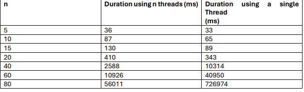

## This was done as part of the concurrency chapter in the software construction course

### Parallelizing the 8 queen solution using Hill Climbing Search

The program was initially made to provide a solution to the 8 queen puzzle: the problem takes place in an n x n chessboard, where we want to find a configuration where no two queens on the chessboard share the same row, column or diagonal. Hill Climbing search looks for the solution by randomly selecting a solution to the problem and iteratively improving it until it satisfies the desired constraints. 

**The problem** is that the time taken to do this operation considerably increases as n becomes larger. As an attempt to reduce the duration, in an n x n chessboard, n parallel threads are started, each one looks for a solution independently and once one finds a solution, it **notifies** the others so they can stop, and we get the solution to the user.

**The design** goes as follows: first we create a group of threads, for an n threads, there is going to n permits per semaphore, one permit per thread, then the **Main** thread blocks until one of the workers threads releases a permit (meaning it found a solution and therefore the Main thread has to continue.) There is also a semaphore with one permit (mutex) that the thread that found a solution uses to stop all other threads still working for one.  When the threads start, they share a data structure that has their found solution.

## Limitation

For n = 2 or 3, there is no solution.

## How to run

javac Main.java
java Main

Enter the number of Queens :
20
Solution to 20 queens using hill climbing search:

0 0 0 0 0 0 0 0 0 0 0 0 0 0 0 0 0 0 1 0 
1 0 0 0 0 0 0 0 0 0 0 0 0 0 0 0 0 0 0 0 
0 0 0 0 0 0 0 0 0 0 0 0 0 0 1 0 0 0 0 0 
0 0 0 0 0 0 0 0 0 0 0 0 1 0 0 0 0 0 0 0 
0 0 0 0 0 0 0 0 0 1 0 0 0 0 0 0 0 0 0 0 
0 0 1 0 0 0 0 0 0 0 0 0 0 0 0 0 0 0 0 0 
0 0 0 0 0 0 1 0 0 0 0 0 0 0 0 0 0 0 0 0 
0 0 0 0 0 0 0 0 0 0 0 0 0 0 0 1 0 0 0 0 
0 0 0 0 0 0 0 0 0 0 0 1 0 0 0 0 0 0 0 0 
0 1 0 0 0 0 0 0 0 0 0 0 0 0 0 0 0 0 0 0 
0 0 0 0 0 0 0 0 0 0 0 0 0 0 0 0 1 0 0 0 
0 0 0 0 0 0 0 0 0 0 0 0 0 1 0 0 0 0 0 0 
0 0 0 0 0 0 0 0 0 0 0 0 0 0 0 0 0 0 0 1 
0 0 0 0 1 0 0 0 0 0 0 0 0 0 0 0 0 0 0 0 
0 0 0 0 0 0 0 1 0 0 0 0 0 0 0 0 0 0 0 0 
0 0 0 0 0 0 0 0 0 0 1 0 0 0 0 0 0 0 0 0 
0 0 0 0 0 0 0 0 0 0 0 0 0 0 0 0 0 1 0 0 
0 0 0 1 0 0 0 0 0 0 0 0 0 0 0 0 0 0 0 0 
0 0 0 0 0 1 0 0 0 0 0 0 0 0 0 0 0 0 0 0 
0 0 0 0 0 0 0 0 1 0 0 0 0 0 0 0 0 0 0 0  
Execution Time: 372 ms

## What about having one thread doing all of this? 

Here is a comparaison between the two:

