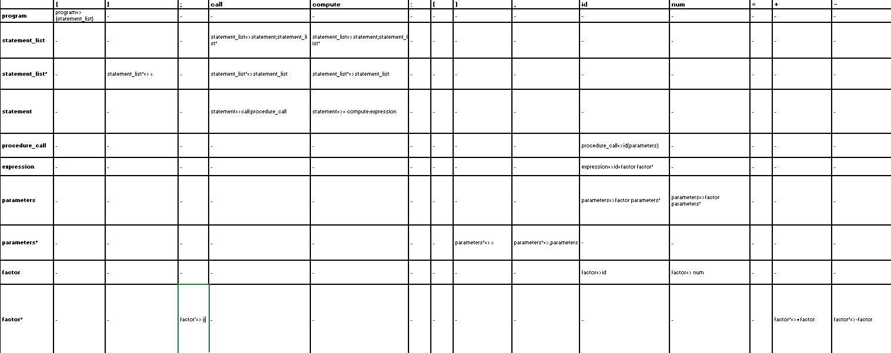

## This was done as part of the introduction to compilers chapter in the software construction course. 

**Recursive Decent parser** is a parser that takes input as a text file and outputs whether the input given follows the context free grammar this parser is defining.

**To run**, just compile the java file usig "**javac RecursiveDescentParser.java**" and run "**java RecursiveDescentParser inputx.txt**". You can either provide your own input.txt file or use the ones present under the tests directory.

### Sample run:

javac .\RecursiveDescenntParser.java

java RecursiveDescentParser input1.txt

#### OutPut 1:  
The program is starting to parse the file: input1.txt   
SUCCESS: the code has been successfully parsed   
The last token to be read was: $    

#### OutPut 2:
The program is starting to parse the file: input2.txt    
ERROR: the code contains a syntax mistake    
There was a problem with token: \} at position: 35    

## The grammar that the parser is defining is the following:

&lt;program&gt; 		    ::= {&lt;statement_list&gt;}  
&lt;statement_list&gt; 	    ::= &lt;statement&gt;;&lt;statement_list&gt;|&lt;statement&gt;;   
&lt;statement&gt; 		    ::= call: &lt;procedure_call&gt;|compute: &lt;expression&gt;   
&lt;procedure_call&gt;	        ::= id(&lt;parameters&gt;)   
&lt;parameters&gt;		    ::= &lt;factor&gt;,&lt;parameters&gt;|&lt;factor&gt;    
&lt;expression&gt; 		    ::= id=&lt;factor&gt;+&lt;factor&gt;|id=&lt;factor>-&lt;factor&gt;|id=&lt;factor&gt;   
&lt;factor&gt; 		        ::= id|num

Note that this grammar was updated by making **left factoring** where applicable. After the left factoring, the grammar is the following.
No **left recursion** was detected.

&lt;program>     		    ::= {&lt;statement_list&gt;}    
&lt;statement_list>	        ::=&lt;statement&gt;;&lt;statement_list’&gt;    
&lt;statement_list’>	    ::=&lt;statement_list | ε     
&lt;statement>		        ::=call:&lt;procedure_call&gt; | &lt;compute:expression&gt;     
&lt;procedure_call>	        ::=id(&lt;parameters&gt;)    
&lt;parameters>		        ::=&lt;factor>&lt;parameters’&gt;    
&lt;parameters’>		    ::=,&lt;parameters&gt; | ε     
&lt;expression>		        ::=id=&lt;factor>&lt;factor’&gt;     
&lt;factor’>		        ::=+&lt;factor&gt;|-&lt;factor&gt;| ε     
&lt;factor>		            ::= id|num     

The grammar now is an **LL(1) grammar**, meaning it uses the left most derivations, making the parser predictive and a bit more efficient than the Top down parsers that randomly chose a production and have to backtrack each and every time there is a problem.

After some tedious calculations of the First and Follow sets,the parsing table is provided below:

### How to interpret the parsing table?

suppose we want to parse: **{ compute: a = 15;}**

we will use a stack. let's start by pushing the end of string $

|$|

Push the first non-terminal into the stack, i.e: program

|   program &nbsp;&nbsp;&nbsp;&nbsp;&nbsp;&nbsp;&nbsp;|     
|   $       &nbsp;&nbsp;&nbsp;&nbsp;&nbsp;&nbsp;&nbsp;&nbsp;&nbsp;&nbsp;&nbsp;&nbsp;&nbsp;&nbsp;&nbsp;&nbsp;&nbsp;&nbsp;&nbsp;|     

Our input is **{ compute: a = 15;}**

pop program from the stack, for a terminal of **{**, we can see the following production for program: **program=>{statement_list}** , push this production:

|&nbsp;{  &nbsp;&nbsp;&nbsp;&nbsp;&nbsp;&nbsp;&nbsp;&nbsp;&nbsp;&nbsp;&nbsp;&nbsp;&nbsp;&nbsp;&nbsp;&nbsp;&nbsp;&nbsp;&nbsp;&nbsp;&nbsp;&nbsp;&nbsp;            | 
|&nbsp;statement_list &nbsp;&nbsp;   | 
|&nbsp;}          &nbsp;&nbsp;&nbsp;&nbsp;&nbsp;&nbsp;&nbsp;&nbsp;&nbsp;&nbsp;&nbsp;&nbsp;&nbsp;&nbsp;&nbsp;&nbsp;&nbsp;&nbsp;&nbsp;&nbsp;&nbsp;&nbsp;&nbsp; | 
|&nbsp;$                      &nbsp;&nbsp;&nbsp;&nbsp;&nbsp;&nbsp;&nbsp;&nbsp;&nbsp;&nbsp;&nbsp;&nbsp;&nbsp;&nbsp;&nbsp;&nbsp;&nbsp;&nbsp;&nbsp;&nbsp;&nbsp;&nbsp; | 

the top of the stack is a terminal: **{**, we check if the terminal corresponds to the head of the input. Yes! then pop **{** from the stack: our remaining input to parse is: compute: **a = 15;}**

the stack now looks like:

|statement_list &nbsp;&nbsp;&nbsp; |  
|} &nbsp;&nbsp;&nbsp;&nbsp;&nbsp;&nbsp;&nbsp;&nbsp;&nbsp;&nbsp;&nbsp;&nbsp;&nbsp;&nbsp;&nbsp;&nbsp;&nbsp;&nbsp;&nbsp;&nbsp;&nbsp;&nbsp;&nbsp;&nbsp;&nbsp;|  
|$ &nbsp;&nbsp;&nbsp;&nbsp;&nbsp;&nbsp;&nbsp;&nbsp;&nbsp;&nbsp;&nbsp;&nbsp;&nbsp;&nbsp;&nbsp;&nbsp;&nbsp;&nbsp;&nbsp;&nbsp;&nbsp;&nbsp;&nbsp;&nbsp;|  

the head of the input is the terminal **compute**, going back to the parsing table, with a non-terminal of **statement_list**, we can get the production: **statement_list=>statement;statement_list'**

pop statement_list from the stack and insert the production:

|statement &nbsp;&nbsp;&nbsp;&nbsp;&nbsp;&nbsp;&nbsp;&nbsp;&nbsp;&nbsp;&nbsp;&nbsp;&nbsp;&nbsp; | 
|; &nbsp;&nbsp;&nbsp;&nbsp;&nbsp;&nbsp;&nbsp;&nbsp;&nbsp;&nbsp;&nbsp;&nbsp;&nbsp;&nbsp;&nbsp;&nbsp;&nbsp;&nbsp;&nbsp;&nbsp;&nbsp;&nbsp;&nbsp;&nbsp;&nbsp;&nbsp;&nbsp;&nbsp;&nbsp; | 
|statement_list' &nbsp;&nbsp;&nbsp;&nbsp;&nbsp;&nbsp;&nbsp; | 
|} &nbsp;&nbsp;&nbsp;&nbsp;&nbsp; &nbsp;&nbsp;&nbsp;&nbsp;&nbsp;&nbsp;&nbsp;&nbsp;&nbsp;&nbsp;&nbsp;&nbsp;&nbsp;&nbsp;&nbsp;&nbsp;&nbsp;&nbsp;&nbsp;&nbsp;&nbsp;&nbsp;&nbsp;&nbsp;| 
|$ &nbsp;&nbsp;&nbsp;&nbsp;&nbsp;&nbsp;&nbsp;&nbsp;&nbsp;&nbsp;&nbsp;&nbsp;&nbsp;&nbsp;&nbsp;&nbsp;&nbsp;&nbsp;&nbsp;&nbsp;&nbsp;&nbsp;&nbsp;&nbsp;&nbsp;&nbsp;&nbsp;&nbsp;&nbsp;| 

Now we have the production statement, remember, the terminal that our input has is still compute, the parsing table says for a terminal compute, and a non terminal statement, the production is: **statement=>compute:expression**. Now we pop statement from the stack and we push this production:

|compute &nbsp;&nbsp;&nbsp;&nbsp;&nbsp;&nbsp;&nbsp;  | 
|: &nbsp;&nbsp;&nbsp;&nbsp;&nbsp;&nbsp;&nbsp;&nbsp;&nbsp;&nbsp;&nbsp;&nbsp;&nbsp;&nbsp;&nbsp;&nbsp;&nbsp;&nbsp;&nbsp;&nbsp; | 
|expression &nbsp;&nbsp;&nbsp;&nbsp; |   
|; &nbsp;&nbsp;&nbsp;&nbsp;&nbsp;&nbsp;&nbsp;&nbsp;&nbsp;&nbsp;&nbsp;&nbsp;&nbsp;&nbsp;&nbsp;&nbsp;&nbsp;&nbsp;&nbsp;&nbsp;  | 
|statement_list'|    
|\} &nbsp;&nbsp;&nbsp;&nbsp;&nbsp;&nbsp;&nbsp;&nbsp;&nbsp;&nbsp;&nbsp;&nbsp;&nbsp;&nbsp;&nbsp;&nbsp;&nbsp;&nbsp;&nbsp;&nbsp;  | 
|$ &nbsp;&nbsp;&nbsp;&nbsp;&nbsp;&nbsp;&nbsp;&nbsp;&nbsp;&nbsp;&nbsp;&nbsp;&nbsp;&nbsp;&nbsp;&nbsp;&nbsp;&nbsp;&nbsp;&nbsp;| 

We have a terminal in the top of the stack! Let's check if it's corresponds to the one in the beginning of our input. As a reminder, the remaining input to parse is: compute: a = 15;\}

it does! pop compute from the stack, the remaining input to parse is: :a = 15;\}

|:  &nbsp;&nbsp;&nbsp;&nbsp;&nbsp;&nbsp;&nbsp;&nbsp;&nbsp;&nbsp;&nbsp;&nbsp;&nbsp;&nbsp;&nbsp;&nbsp;&nbsp;&nbsp;&nbsp;&nbsp;&nbsp;&nbsp;|  
|expression &nbsp;&nbsp;&nbsp;&nbsp;&nbsp; |  
|; &nbsp;&nbsp;&nbsp;&nbsp;&nbsp;&nbsp;&nbsp;&nbsp;&nbsp;&nbsp;&nbsp;&nbsp;&nbsp;&nbsp;&nbsp;&nbsp;&nbsp;&nbsp;&nbsp;&nbsp;&nbsp; |  
|statement_list' |   
|\} &nbsp;&nbsp;&nbsp;&nbsp;&nbsp;&nbsp;&nbsp;&nbsp;&nbsp;&nbsp;&nbsp;&nbsp;&nbsp;&nbsp;&nbsp;&nbsp;&nbsp;&nbsp;&nbsp;&nbsp;&nbsp; |  
|$ &nbsp;&nbsp;&nbsp;&nbsp;&nbsp;&nbsp;&nbsp;&nbsp;&nbsp;&nbsp;&nbsp;&nbsp;&nbsp;&nbsp;&nbsp;&nbsp;&nbsp;&nbsp;&nbsp;&nbsp; |  

There is another  terminal in the stack! the **:** . Does the start of the input to parse have the same terminal? Yep, now let's pop **:** from the stack

|expression &nbsp;&nbsp;&nbsp;&nbsp; &nbsp;  |  
|; &nbsp;&nbsp;&nbsp;&nbsp;&nbsp;&nbsp;&nbsp;&nbsp;&nbsp;&nbsp;&nbsp;&nbsp;&nbsp;&nbsp;&nbsp;&nbsp;&nbsp;&nbsp;&nbsp;&nbsp;&nbsp;&nbsp;    | 
|statement_list'   |  
|\} &nbsp;&nbsp;&nbsp;&nbsp;&nbsp;&nbsp;&nbsp;&nbsp;&nbsp;&nbsp;&nbsp; &nbsp;&nbsp;&nbsp;&nbsp;&nbsp;&nbsp;&nbsp;&nbsp;&nbsp; | 
|$ &nbsp;&nbsp;&nbsp;&nbsp;&nbsp;&nbsp;&nbsp;&nbsp;&nbsp;&nbsp;&nbsp;&nbsp;&nbsp;&nbsp;&nbsp;&nbsp;&nbsp;&nbsp;&nbsp;&nbsp; | 

The remaining input to parse is: **a=15;\}**

a is an id, the parsing table says for a non terminal  expression, and a terminal of id, the production is: **expression=>id=factor factor'**

pop expression and push this production:

|&nbsp;&nbsp;&nbsp;&nbsp;id &nbsp;&nbsp;&nbsp;&nbsp; &nbsp;&nbsp;&nbsp;&nbsp;&nbsp;&nbsp;&nbsp;&nbsp;&nbsp;&nbsp;&nbsp;&nbsp;&nbsp;&nbsp;| 
|&nbsp;&nbsp;&nbsp;&nbsp;=&nbsp;&nbsp;&nbsp;&nbsp; &nbsp;&nbsp;&nbsp;&nbsp;&nbsp;&nbsp;&nbsp;&nbsp;&nbsp;&nbsp;&nbsp;&nbsp;&nbsp;&nbsp;&nbsp; | 
|&nbsp;&nbsp;&nbsp;&nbsp;factor &nbsp;&nbsp;&nbsp;&nbsp;&nbsp;&nbsp;&nbsp;&nbsp;&nbsp;&nbsp;&nbsp;&nbsp; |  
|&nbsp;&nbsp;&nbsp;&nbsp;factor' &nbsp;&nbsp;&nbsp;&nbsp;&nbsp;&nbsp;&nbsp;&nbsp;&nbsp;&nbsp;&nbsp; | 
|&nbsp;&nbsp;&nbsp;&nbsp;;&nbsp;&nbsp;&nbsp;&nbsp; &nbsp;&nbsp;&nbsp;&nbsp;&nbsp;&nbsp;&nbsp;&nbsp;&nbsp;&nbsp;&nbsp;&nbsp;&nbsp;&nbsp;&nbsp;  | 
|&nbsp;&nbsp;statement_list'&nbsp;&nbsp;&nbsp;&nbsp;&nbsp;&nbsp;&nbsp;&nbsp; | 
|&nbsp;&nbsp;&nbsp;&nbsp;\} &nbsp;&nbsp;&nbsp;&nbsp; |  
|$ &nbsp;&nbsp;&nbsp;&nbsp;| 

we have a terminal at the top of the stack, id, and the start of our input to parse is a, so it's an id, meaning there is a match!

pop from the stack:

######################## 
=  
factor   
factor'    
;    
statement_list'    
\}    
$  
########################
 

Our remaining input to parse is **=15;\}**

and we have = at the top of the stack, pop it!

####################### 
factor    
factor'   
;   
statement_list'   
}    
$   
###################### 

Our remaining input to parse is:

15;}

we have factor at the top of the stack, factor gives a production of factor=>num for a num. then pop factor and push this production:

########################## 
factor'  
;   
statement_list'   
}   
$  
########################## 

Our remaining input to parse is:

;}

for a terminal of ; and a non terminal of factor', the production is: factor'=>ε. ε means an empty string, so we won't push anything. but we will pop factor'.

the remaining input to parse is:   ;}

The stack is: 

######################### 
;    
statement_list'    
}    
$  
######################### 

the terminal at the top of the stack and at the beginning of the input to parse match, so we pop from the stack:

####################### 
statement_list'    
}     
$  
####################### 

the remaining input to parse is:    }

for }, statement_list' gives a production of ε again, we won't push anything but we will pop statement_list'.

the stack is now:

######### 
}   
$  
######### 

the top of the stack and the start of the input to parse is the same. so we pop }.

there is no more input to parse. and the stack is now just $. $ means the end of the string. That way we have concluded parsing our input.

### Please note that it is quite a process to build this parse table first, and then use it to parse a small input like the one we had earlier. This program saves you time in the sense that you just have to give it an input, and it will tell you whether it conforms to the grammar. It does the above checking for you under the hood, so you won't do it manually. It will even tell you where there is a problem, if it encounters any. Power of computing!

